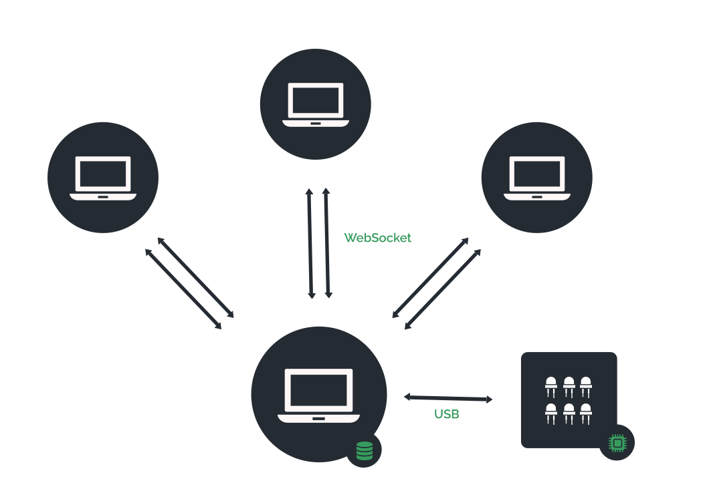

<h1 align="center">
  <br>
  <a href="http://www.arbalet-project.org/"></a>

  Arbalet Meki Live
  <br>
</h1>

<div align="center">

[](https://twitter.com/arbalet_project)
</div>

<h4 align="center">Documentation développeur</h4>

<p align="center">
  <a href="#présentation">Présentation</a> •
  <a href="#fonctionnement-général">Fonctionnement général</a> •
  <a href="#démarrage-rapide">Démarrage rapide</a> •
  <a href="#structure-de-fichiers">Structure de fichiers</a> •
  <a href="#compilation">Compilation</a> •
  <a href="#évolutions">Évolutions</a> •
  <a href="#dépannages">Dépannages</a> •
  <a href="#support">Support</a>
</p>

# Présentation 
Cette documentation s'adresse aux développeurs souhaitant comprendre rapidement le fonctionnement général de l'application Arbalet Meki Live. Elle comporte également quelques conseils et instructions relatifs au développement et à la compilation du projet.

# Fonctionnement général 
<div align="center" >

</div>
À son lancement l'application démarre un serveur web (Express.js) écoutant sur le port 3000. Celui-ci délivre aux clients les différents fichiers composants l'interface élève. La communication entre les clients et le serveur se fait ensuite par le biais de web-sockets.<br/>
La communication entre le serveur et la table se fait via USB à travers le port série.


# Démarrage rapide
## Pré-requis
* Avoir la dernière version de Node.Js installée
* Etre administrateur sur sa machine
## Installation
1. Cloner la dernière version du projet.
2. Se rendre dans le dossier `desktop` et installer les modules:
  ```shell
  $ npm install
  ```
3. Lancer le projet:
```shell
$ npm start
```
En cas d'erreur lors du lancement, consulter la section [Dépannages](#dépannages)

# Structure de fichiers
## Desktop
L'application desktop comprend deux fichiers JavaScript principaux:
* [main.js](main.md) composant le programme principal
* [renderer.js](./renderer.js) comprenant le code s'exécutant dans la vue d'ElectronJS

Les deux communiquent via un système de "messages" sous la forme d'évènements.

## Navigateur
Tout le code relatif à l'interface élève se trouve dans le dossier `public`.
On y distingue deux fichiers principaux:
* [mainClient.js](./mainClient.md) comprenant les fonctionnalités principales de l'application
* [front.js](./front.md) comprenant toutes les méthodes relatives à l'affichage et l'intéraction de la page web

Les différents fichiers utilisés par Blockly se trouvent dans le dossier `blockly`.

Le fichier [blocklyWorker.js](./blocklyWorker.md) comprend le code du web-worker interprétant le code généré par Blockly. Ce système de worker permet d'exécuter ce code dans un thread différent du thread principal empechant tout bloquage. Cela permet aussi de stopper l'exécution du code à tout moment. </br>
 Vous trouverez plus d'informations sur les Web-Workers <a href="https://developer.mozilla.org/fr/docs/Web/API/Web_Workers_API/Utilisation_des_web_workers">ici</a>. 

# Compilation
Pour compiler le projet et générer un exécutable vous devez vous trouver sur la plateforme correspondante à la cible (être sur Linux pour compiler pour Linux, etc...).<br/>
Rendez-vous dans le dossier `desktop` et exécutez la commande suivante:
```shell
$ npm run dist
```
<!-- -->
<br/>
Les exécutables générés sont ensuite trouvables dans le dossier `dist`. <br/>
Les différents paramètres relatifs à la compilation se trouvent dans le fichier `package.json`. <br/>
Pour la compilation nous utilisons le module `electron-builder`. Vous trouverez plus d'informations concernant la compilation en suivant ce <a href="https://www.electron.build/configuration/configuration"> lien</a>.

# Évolutions
## Hardware
La solution proposée ici est une solution temporaire puisque nous utilisons dans cette version un Arduino "classique" comportant un custom firmware Firmata ainsi que les librairies Johnny-Five et Node-Pixel afin de communiquer avec celui-ci. <br/>
La version finale d'Arbalet Meki sera équipée d'une carte ESP32 tournant avec un firmware "maison". Ainsi Arbalet Meki aura un fonctionnement hybride lui permettant d'avoir deux modes: autonome et atelier. </br> Cette version est en avancement et vous pourrez trouver les informations nécessaires à sa mise en oeuvre dans [cette documentation](../firmware/sequence/README_FR.md).

## Ajout de nouveaux blocs Blockly
La création de blocs se fait par l'intermédiaire de l'éditeur de programmation visuelle de Blockly. Il se trouve à cette [adresse](https://blockly-demo.appspot.com/static/demos/blockfactory/index.html) avec la documentation associé à l'éditeur
[Blockly Developer Tools](https://developers.google.com/blockly/guides/create-custom-blocks/blockly-developer-tools).

Les blocs créés sont stockés dans différents fichiers :
- Définition des blocs en JSON dans [`blockdefinition.js`](../desktop/public/blockly/blockdefinition.js)
- Définition du code JavaScript correspondant aux blocs dans [`generatorstub.js`](../desktop/public/blockly/generatorstub.js)
- Affichage des blocs dans la balise xml présente dans [`index.html`](../desktop/public/index.html)

## Internationalisation
Arbalet Meki Live est pour l'instant uniquement disponible en français. Seuls les blocs Blockly bénéficient d'une traduction s'adaptant à la langue de l'ordinateur serveur.<br/>
Il faudrait mettre en place un système de traduction performant. Une piste qui nous paraissait intéressante est celle du module npm [i18n](https://www.npmjs.com/package/i18n).

# Dépannages
## Erreur de module au lancement
Certains modules nécessitent une recompilation afin d'être compatibles avec Electron. Cela peut générer un message d'erreur lors du lancement du projet en développement. C'est notamment le cas du module `serial-port`.</br>
Pour recompiler, exécutez la commande suivante dans le dossier `desktop`:
```shell
$ node_modules/.bin/electron-rebuild
```

## Erreur de compilation sur MacOS
Il arrive que le module `fsevents` génère des erreurs lors de la compilation sur MacOS. <br/>
Pour palier à ce problème nous vous conseillons d'utiliser le gestionnaire de paquets `yarn` à la place de npm. </br>
Pour l'installer exécutez la commande suivante:
```shell
$ npm install -g yarn
```
Lancez ensuite la compilation de cette manière:
```shell
$ yarn dist
```

# Dépannage rapide
### Erreur `serialport was compiled against a different Node.js version`
Exécuter `./node_modules/.bin/electron-rebuild`, merci https://stackoverflow.com/a/52796884/3884647

# Support

-  Website at [`arbaletproject.org`](http://www.arbalet-project.org/)

- Twitter at [`@arbalet_project`](https://twitter.com/arbalet_project)

-  Linkedin at [`arbalet`](https://www.linkedin.com/company/arbalet/)
-  Blog at [`arbalet-blog`](http://talk.arbalet-project.org/)
---
