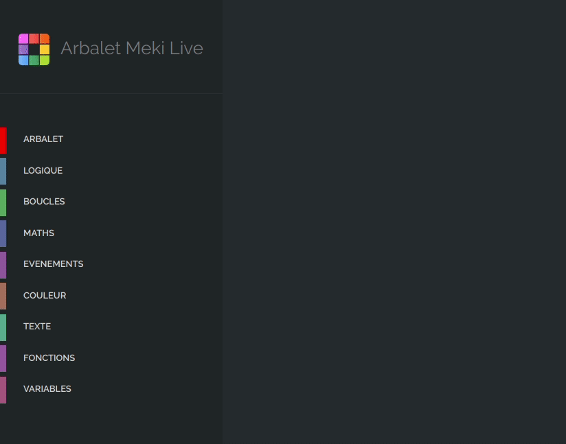
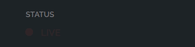
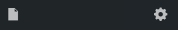
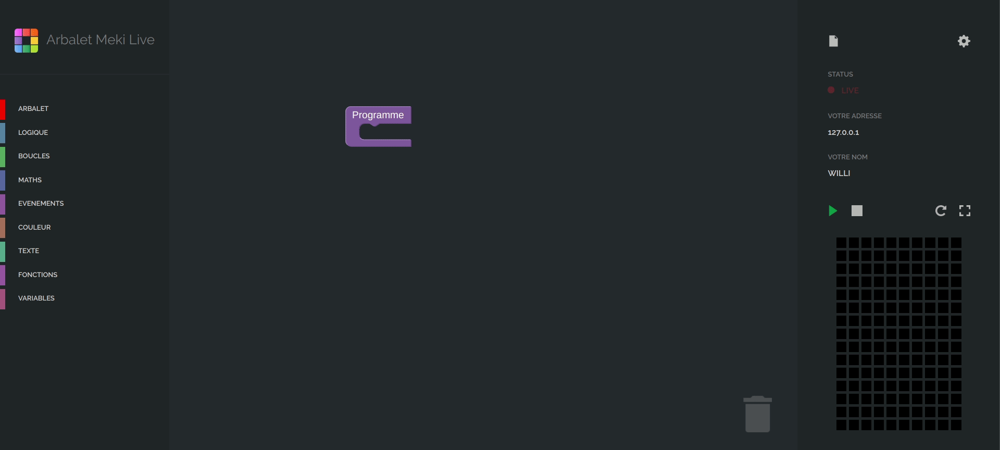

<h1 align="center">
  <br>
  <a href="http://www.arbalet-project.org/"></a>

  Arbalet Meki Live
  <br>
</h1>

<div align="center">

[](https://twitter.com/arbalet_project)
</div>

<h4 align="center">Documentation utilisateur</h4>

<p align="center">
  <a href="#présentation">Présentation</a> •
  <a href="#installation">Installation</a> •
  <a href="#utilisation">Utilisation</a> •
  <a href="#support">Support</a>
</p>

# Présentation 

Cette documentation s'adresse aux enseignants et animateurs d'atelier souhaitant utiliser l'application Arbalet Meki Live.

# Installation

## Arbalet
Si vous êtes équipé(e) d'une table Arbalet Lack ou Lava (comprenant un Arduino), il vous faut installer un firmware spécifique sur celui-ci:

1. Branchez votre Arduino à l'ordinateur via USB.
2. Installez le module de gestion de firmware Interchange:
   ```shell
   $ npm install -g nodebots-interchange
   ```
3. Chargez le custom firmware sur l'Arduino:
    ```shell
    $ interchange install git+https://github.com/ajfisher/node-pixel -a uno --firmata
    ```
<!-- -->
Si votre table est équipée du duo Arduino/Rasperry Pi vous ne devez laisser que l'Arduino et brancher celui-ci à votre ordinateur.


## Windows/Mac/Linux
Téléchargez l'exécutable correspondant à votre système et installez le. Il existe une version portable et un installeur pour chacun des systèmes.
  
# Utilisation 
## Application Desktop - Interface Enseignant
Après avoir lancé l'application, vous arrivez sur l'interface administrateur d'Arbalet Meki Live.
L'application est découpée en deux catégories :

#### Utilisateurs connectés
* `ORDINATEUR` : nom de l'élève 
* `ADRESSE` : adresse IP de l'élève
* `ETAT` :  autoriser l'accès à la table à un élève

#### Connexion
* `STATUS` : connexion à la table Arbalet
* `VOTRE ADRESSE` : adresse qui permet aux élèves de se connecter à l'application (il faut la rentrer dans l'url de votre navigateur)

## Fonctionnement
1. Branchez la table sur un des ports USB de votre ordinateur
2. Cliquez sur le bouton "Se connecter" à droite de votre écran
3. Entrez le numéro de PIN sur lequel la broche data de la bande de LED est connectée (numéro 8 par défaut) puis cliquez sur OK
4. Après chargement l'application vous indique si la table est bien connectée, le cas échéant vous invitant à vérifier vos branchements
5. Donner votre adresse aux élèves/participants et invitez les à la rentrer dans leur navigateur. Il est primordial que leurs postes soient connectés au même réseau local que le votre. Pour des raisons de performances nous vous conseillons une connexion filaire (le wifi pouvant augmenter la latence).
6. Les élèves/utilisateurs connectés s'affichent sur la partie centrale de l'écran. Vous pouvez choisir à tout moment lequel a le contrôle sur la table.

## Interface Élève - Navigateur
Comme mentionné ci-dessus l'élève doit rentrer votre adresse complète dans son navigateur. Nous conseillons l'utilisation du navigateur <a href="https://www.google.com/chrome/">Google Chrome</a> (ou sa version open-source <a href="https://chromium.woolyss.com/download/fr/">Chromium</a>) afin de pouvoir bénéficier de toutes les fonctionnalités proposées par Arbalet Meki Live. <br/><br/>
Après que l'élève ai rentré l'adresse pour accéder à l'application, la fenêtre d'accueil lui permet d'écrire son nom. L'élève arrive ensuite sur l'interface de programmation qui est composée de plusieurs catégories : 

### Blocs de programmation
Les blocs de programmation sont rangés par catégories (Texte, Fonctions, Arbalet, etc..) sur la gauche de l'interface.

<div align="center">
  
</div>

### Espace de travail
L'espace de travail au centre, permet de contenir les blocs de programmation et d'écrire des algorithmes.

### Configuration 
 

Quand l'utilisateur est connecté à la table, le status devient rouge clignotant avec écrit `LIVE`. </br> L'exécution du programme se fait en parallèle dans la simulation du navigateur et sur la table.

### Menu projet 


L'icône a droite permet de créer un nouveau projet, l'icône de gauche permet :
- Importer un ancien projet
- Exporter le projet 
- Accéder aux exemples de programmes

### Exécution du programme
Vous trouverez à droite de l'écran, au dessus de la simulation différents boutons permettant:
* l'exécution du code
* l'arrêt de l'exécution
* la rotation de la simulation
* l'affichage de la simulation en plein écran

### Aperçu du code
 

# Support

-  Website at [`arbaletproject.org`](http://www.arbalet-project.org/)

- Twitter at [`@arbalet_project`](https://twitter.com/arbalet_project)

-  Linkedin at [`arbalet`](https://www.linkedin.com/company/arbalet/)
-  Blog at [`arbalet-blog`](http://talk.arbalet-project.org/)
---