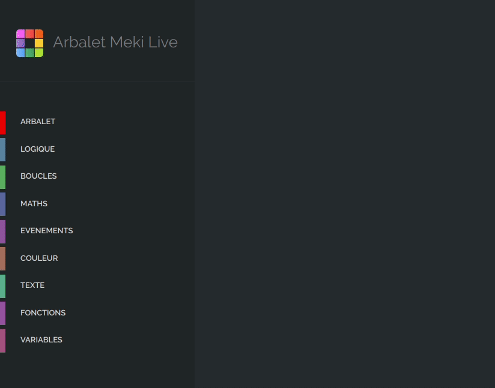
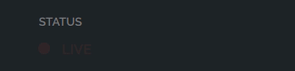
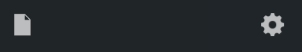
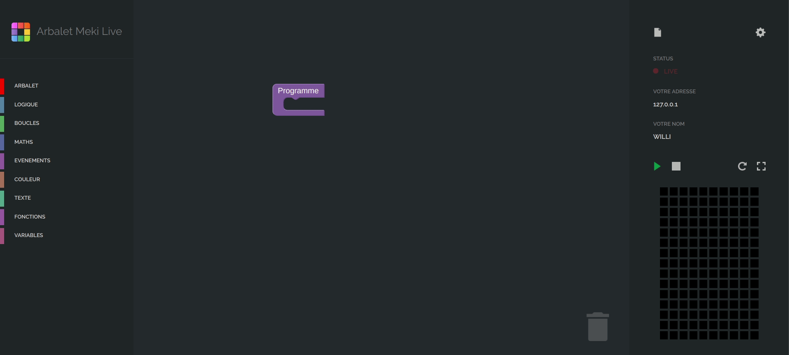

<h1 align="center">
  <br>
  <a href="http://www.arbalet-project.org/"></a>

  Arbalet Meki Live
  <br>
</h1>

<div align="center">

[](https://twitter.com/arbalet_project)
</div>

<h4 align="center">Documentation utilisateur</h4>

<p align="center">
  <a href="#présentation">Présentation</a> •
  <a href="#installation">Installation</a> •
  <a href="#utilisation">Utilisation</a> •
  <a href="#credits">Credits</a> •
  <a href="#support">Support</a>
</p>

<div align="center" >


</div>

# Présentation 

Cette documentation s'adresse aux professeurs d'écoles souhaitant mettre en place l'application Arbalet Meki Live.

# Installation 

## Windows
- Téléchargez le fichier .exe
- Double-Cliquer sur le fichier .exe

## MacOS
????
## Linux 
> update and install this package first

```shell
$ brew install fvcproductions
```
# Utilisation 
## Interface Professeur
Après avoir executer l'application, vous arrivez sur l'interface administrateur d'Arbalet Meki Live.
L'application est découpé en deux catégories :

### Utilisateurs connectés
* `ORDINATEUR` : nom de l'élève 
* `ADRESSE` : adresse IP de l'élève
* `ETAT` :  autoriser l'accès à la table à un élève

### Connexion
* `STATUS` : 
* `VOTRE ADRESSE` : adresse qui permet aux élèves de se connecter à l'application 
* `MODE CONNEXION` : USB

## Interface Élève
Après que l'élève est rentré l'adresse pour accéder à l'application, la fenêtre d'accueil permet d'écrire son nom. L'élève arrive ensuite sur l'interface de programmation qui se découpe en plusieurs catégories : 

### Blocs de programmation
Les blocs de programmation sont rangés par catégories (Texte, Fonctions, Arbalet, etc..) sur la gauche de l'interface.

<div align="center">
  
</div>

### Espace de travail
L'espace de travail au centre, permet de contenir les blocs de programmation et d'effectuer des algorithmes.

### Configuration 
 

Quand on est connecté à la table, le status devient rouge clignotant avec écrit `LIVE`.

### Nouveau projet 


L'icone a droite permet de créer un nouveau projet, l'icone de gauche permet :
- Importer un ancien projet
- Exporter le projet 
- Accéder aux exemples de programmes

### Compilation du code 
Play / Stop / Rotate


### Aperçu du code
 

# Support

-  Website at [`arbaletproject.org`](http://www.arbalet-project.org/)

- Twitter at [`@arbalet_project`](https://twitter.com/arbalet_project)

-  Linkedin at [`arbalet`](https://www.linkedin.com/company/arbalet/)
-  Blog at [`arbalet-blog`](http://talk.arbalet-project.org/)
---